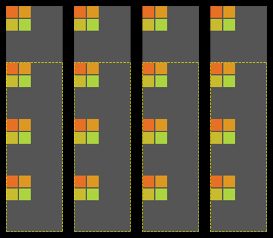

# pixi6-mask-test

Stage is layed out as follows:

Each "strip" is a masked container with 4 gray boxes, each box containing 4 masked sprites (the colored boxes).

One box in each strip is outside the masked area (represented by the dashed yellow lines).

[test with scissor masking enabled (default)](https://jmlee2k.github.io/pixi6-mask-test/) - visiting this link in chrome (or edge) with webGL2 on windows and leaving the page open for a few minutes will cause a hang, and the webGL context will be lost.
This doesn't appear to occur on firefox, or on chrome with webGL1.

[test with scissor masking disabled](https://jmlee2k.github.io/pixi6-mask-test/?noscissor) - this link works as expected without issue.
